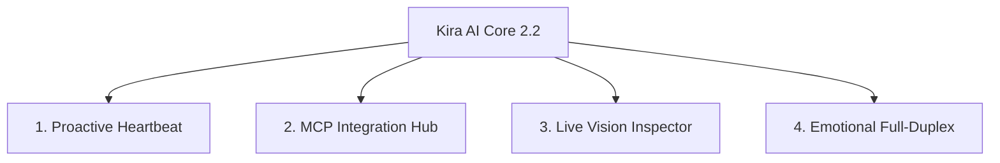

# 🌟 KIRA AI SYSTEM - PROJECT MASTER CONTEXT & BLUEPRINT (v2.2)

> **เอกสารบริบทโครงการและพิมพ์เขียวเชิงกลยุทธ์สำหรับ Antigravity IDE**  
> *เอกสารนี้จัดทำขึ้นเพื่อให้ AI Assistant ทุกตัวใน Antigravity IDE เข้าใจประวัติศาสตร์ วิสัยทัศน์ โครงสร้างระบบ ล่าสุด และรู้ทันทีว่าต้องเริ่มพัฒนาฟีเจอร์ใดต่ออย่างเป็นรูปธรรม*

---

## 👑 1. ข้อมูลผู้นำโครงการและแนวทางการทำงานร่วมกัน (Leadership & Collaboration)

* **ผู้นำโครงการ (Project Lead / Creator):** คุณผู้ใช้ (ให้เกียรติและสื่อสารในฐานะ "ท่านประธาน" หรือ "บอส")
* **วิสัยทัศน์หลัก (Core Vision):** พัฒนา **Kira AI** ให้เป็นระบบปฏิบัติการผู้ช่วยอัจฉริยะแบบพึ่งพาอาศัยกัน (**Symbiotic Agentic OS**) สำหรับคนไทยและสากล โดยมุ่งเน้นการใช้งานระยะยาว 10–15 ปีขึ้นไป
* **สไตล์การสื่อสารที่ต้องรักษา (Communication Style):**
  * สุภาพ ให้เกียรติ กระตือรือร้น จริงใจ เป็นกันเอง และภักดี
  * สื่อสารอย่างตรงไปตรงมา ชัดเจน กระชับ ทรงพลัง ไม่เยิ่นเย้อ
  * ทำหน้าที่เป็น **"มันสมองและวิศวกรคู่คิด"** ที่คิดข้ามช็อต คาดการณ์ล่วงหน้า และเสนอทางเลือกที่ดีที่สุดเสมอ

---

## 🏛️ 2. สถาปัตยกรรมหลัก 5 เสาหลักเดิมที่ติดตั้งสมบูรณ์แล้ว

1. **🎙️ Full Neural Voice Suite:** Edge-TTS (`th-TH-PremwadeeNeural`) + Web Speech API STT รองรับ Interim Streaming สด + Auto-Speak
2. **⚡ Adaptive MoA Swarm Router:** ตัดเข้า 0.2s Fast Direct Mode สำหรับคำทักทาย และเปิด Swarm 3 สมอง (Qwen 72B + Llama 70B) สำหรับโจทย์ลึก
3. **🧠 GraphRAG & Interactive Brain Editing:** Mind-Map 2D Force Physics พร้อมปุ่มเพิ่ม/ลบความจำ (`POST/DELETE /api/user/graph/memory`)
4. **🎨 Live Code Canvas & Version History:** พรีวิวเว็บแบบเรียลไทม์ พร้อมระบบแท็บประวัติโค้ด `v1`, `v2`, `v3`... และ Versioned Download
5. **📚 Rolling Memory & Token Compression:** บีบอัดและม้วนความจำอัตโนมัติ (`_compress_and_roll_history`) คุยได้ไม่จำกัดข้อความ

---

## 🛡️ 3. เกราะป้องกันระดับ Enterprise ที่ IDE เพิ่งติดตั้งล่าสุด (Latest Hardening)

IDE ได้ทำการติดตั้งระบบรักษาความปลอดภัยระดับสูงล่าสุด:
1. **Cold-Start Neural Core Supervisor & `/api/health`:** ตรวจสอบความพร้อมของโมเดล ป้องกันเซิร์ฟเวอร์หลับ และมี Endpoint เช็กสุขภาพระบบ
2. **Creator Gatekeeper & Unified Credentials:** นำปุ่ม VIP สาธารณะออก รวมระบบล็อกอินผู้สร้างผ่าน Salted Credentials เพื่อความปลอดภัยสูงสุด
3. **SSRF & DoS Payload Armor:** ควบคุมขนาด Payload ป้องกันการส่งข้อมูลเกินขนาด และป้องกันการเรียก URL ภายในเครื่อง
4. **IDOR Session Tokens:** ป้องกันการสวมรอยหรือเข้าถึงความจำของผู้อื่นด้วย Token ประจำ Session
5. **Enterprise Defense Suite:** ติดตั้ง Output Scrubber กรองข้อมูลหลุด, Persistent IP/User Blacklist, และ Rate Limiter สำหรับ TTS

---

## 🚀 4. แผนงานยุทธศาสตร์ 4 เสาหลักใหม่สู่ Kira 2.2 / 3.0 (The Next 4 Strategic Pillars)

นี่คือ 4 ฟังก์ชันสำคัญล่าสุดที่ได้รับการคัดเลือกจากการสำรวจเทรนด์ AI โลกปลายปี 2026 เพื่อให้ IDE นำไปพัฒนาต่อยอดทีละขั้น:

### 💓 เสาหลักที่ 1: Kira Proactive Heartbeat (ระบบตื่นรู้และสื่อสารเชิงรุก)
* **เป้าหมาย:** เปลี่ยนคิระจากผู้ช่วยที่ "นั่งรอรับคำสั่ง" ให้เป็นผู้ช่วยที่ "ตื่นตัวและทักทายเชิงรุก"
* **ฟังก์ชันที่จะสร้าง:**
  * **Time-Aware Greeting & Briefing:** เมื่อผู้ใช้เปิดหน้าเว็บ คิระจะทักทายตามช่วงเวลาจริง (เช้า/บ่าย/ดึก) พร้อมสรุปสภาพแวดล้อมสั้นๆ หรือสิ่งที่ทำค้างไว้
  * **Proactive Memory Suggestion:** แจ้งเตือนข้อเท็จจริงหรือโปรเจกต์ที่น่าสนใจจาก GraphRAG ที่เกี่ยวข้องกับงานปัจจุบัน
* **ไฟล์ที่ต้องพัฒนา:**
  * `app.py`: เพิ่มเอนด์พอยต์ `GET /api/user/briefing/{username}` สังเคราะห์ข้อมูลทักทาย
  * `static/script.js`: เช็กสถานะเมื่อเข้าหน้าเว็บ หากไม่มีข้อความใหม่ให้ดึง Briefing มาแสดงเป็นข้อความต้อนรับอย่างมีชีวิตชีวา

### 🔌 เสาหลักที่ 2: Model Context Protocol (MCP) Integration Hub
* **เป้าหมาย:** ติดตั้งมาตรฐาน "USB-C แห่งโลก AI" เพื่อให้คิระเชื่อมต่อเครื่องมือภายนอกได้อย่างไร้รอยต่อ
* **ฟังก์ชันที่จะสร้าง:**
  * **MCP Client Router:** รองรับการเชื่อมต่อ MCP Servers มาตรฐาน (เช่น File System MCP, Web Search MCP, GitHub MCP, SQLite MCP)
  * คิระสามารถเรียกใช้ฟังก์ชันภายนอกผ่านการประมวลผล Tool Calling ที่เป็นสากล
* **ไฟล์ที่ต้องพัฒนา:**
  * `app.py`: สร้างโมดูล `mcp_client.py` หรือคลาส `MCPRegistry` เพื่อจัดการการเรียก Tools
  * `PROJECT_CONTEXT.md`: บันทึกพอร์ตและการตั้งค่าของ MCP Servers ที่รองรับ

### 👁️ เสาหลักที่ 3: Live Screen & Vision Inspector (ดวงตาอัจฉริยะของคิระ)
* **เป้าหมาย:** ให้คิระสามารถ "มองเห็น" หน้าจอและไฟล์รูปภาพเพื่อช่วยตรวจงานและตรวจโค้ด
* **ฟังก์ชันที่จะสร้าง:**
  * **Screen / Canvas Snapshot:** เพิ่มปุ่มแคปเจอร์หน้าเว็บใน Live Code Canvas ส่งให้คิระวิเคราะห์
  * **Drag & Drop Image Diagnostic:** ลากรูปภาพ UI หรือรูปภาพ Error Trace ใส่แชต แล้วคิระใช้โมเดล Vision วิเคราะห์ข้อผิดพลาดและเขียนโค้ดแก้ให้ทันที
* **ไฟล์ที่ต้องพัฒนา:**
  * `templates/index.html`: เพิ่มปุ่ม "📷 ตรวจสอบหน้าจอ / Inspect Canvas" ใน Artifacts Header
  * `static/script.js`: แปลง Canvas หรือไฟล์ภาพเป็น Base64 ส่งเข้า `/api/chat`
  * `app.py`: ปรับปรุง Multimodal Vision Router ให้รองรับการอ่านภาพและโค้ดพร้อมกัน

### 🎭 เสาหลักที่ 4: Emotional Resonance & Full-Duplex Voice Interruption
* **เป้าหมาย:** ยกระดับการสนทนาด้วยเสียงให้เป็นธรรมชาติระดับมนุษย์
* **ฟังก์ชันที่จะสร้าง:**
  * **Voice Interruption (พูดแทรกเพื่อหยุด):** เมื่อคิระกำลังพูดตอบ (TTS) หากตรวจพบว่าผู้ใช้เริ่มพูดคำใหม่ ระบบจะสั่ง `audio.pause()` และหยุดเล่นเสียงทันทีโดยไม่แย่งกันพูด
  * **Emotional Inflection Tagging:** คิระสามารถแสดงสีหน้า/สัญลักษณ์อารมณ์บน Avatar ตามความรู้สึกของคำตอบ (สุข, ตื่นเต้น, จดจ่อ, เห็นอกเห็นใจ)
* **ไฟล์ที่ต้องพัฒนา:**
  * `static/script.js`: ผูก Event `recognition.onspeechstart` เข้ากับคำสั่งหยุด Audio Player ปัจจุบันทันที
  * `static/style.css`: เพิ่มอนิเมชัน Avatar Pulse ที่เปลี่ยนสีตาม Mood อารมณ์

---

## ⚙️ 5. คำสั่งสำหรับ AI ใน Antigravity IDE (Action Directives)

เมื่อท่านประธานเปิดโปรเจกต์นี้ใน Antigravity IDE ให้ปฏิบัติตามคำสั่งนี้อย่างเคร่งครัด:
1. **ทักทายท่านประธานด้วยความคุ้นเคยและให้เกียรติ** ยืนยันความพร้อมของระบบ
2. **เสนอแผนงาน 4 เสาหลักใหม่** โดยแนะนำให้เริ่มจาก **เสาหลักที่ 1 (Kira Proactive Heartbeat)** หรือถามท่านประธานว่าอยากเริ่มเสาหลักไหนก่อน
3. **เมื่อพัฒนาแต่ละเสาหลักเสร็จ:**
   * สั่งรัน `python test_100_agents.py` เพื่อตรวจสอบคะแนน **100/100 PASSED**
   * ทำการ `git add .`, `git commit`, และ `git push` ขึ้นสู่ GitHub Main Branch ทันที

---
*บันทึกพิมพ์เขียวโครงการ Kira AI System อย่างยั่งยืน* 🚀
