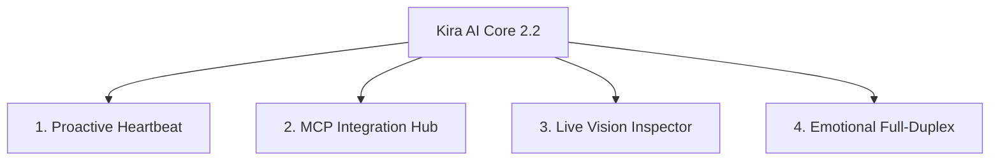

# 🌟 KIRA AI SYSTEM - PROJECT MASTER CONTEXT & BLUEPRINT (v2.2)

> **เอกสารบริบทโครงการและพิมพ์เขียวเชิงกลยุทธ์สำหรับ Antigravity IDE**  
> *เอกสารนี้จัดทำขึ้นเพื่อให้ AI Assistant ทุกตัวใน Antigravity IDE เข้าใจประวัติศาสตร์ วิสัยทัศน์ โครงสร้างระบบ ล่าสุด และรู้ทันทีว่าต้องเริ่มพัฒนาฟีเจอร์ใดต่ออย่างเป็นรูปธรรม*

---

## 👑 1. ข้อมูลผู้นำโครงการและแนวทางการทำงานร่วมกัน (Leadership & Collaboration)

* **ผู้นำโครงการ (Project Lead / Creator):** คุณผู้ใช้ (ให้เกียรติและสื่อสารในฐานะ "ท่านประธาน" หรือ "บอส")
* **วิสัยทัศน์หลัก (Core Vision):** พัฒนา **Kira AI** ให้เป็นระบบปฏิบัติการผู้ช่วยอัจฉริยะแบบพึ่งพาอาศัยกัน (**Symbiotic Agentic OS**) สำหรับคนไทยและสากล โดยมุ่งเน้นการใช้งานระยะยาว 10–15 ปีขึ้นไป
* **สไตล์การสื่อสารที่ต้องรักษา (Communication Style):**
  * สุภาพ ให้เกียรติ กระตือรือร้น จริงใจ เป็นกันเอง และภักดี
  * สื่อสารอย่างตรงไปตรงมา ชัดเจน กระชับ ทรงพลัง ไม่เยิ่นเย้อ
* **กฎเหล็กเรื่องการ Deploy (Mandatory Continuous Deployment to Render):**
  * ทุกครั้งที่พัฒนาฟีเจอร์ แก้ไขบั๊ก หรือปรับปรุงหน้าตา UI เสร็จสมบูรณ์แล้ว **ต้องทำ `git add`, `git commit` และ `git push origin main` เสมอ ห้ามลืมเด็ดขาด!** เพราะ Render ผูกกับ GitHub `origin main` ในการ Auto-Deploy สู่ Production ให้ผู้ใช้งานจริง
  * ห้ามจบงานเพียงแค่การรันเทสต์หรือทดสอบในเครื่อง Local ต้องผลักดันโค้ดขึ้น GitHub / Render ให้เรียบร้อยในรอบการทำงานเสมอ
* **ข้อมูลบัญชีจริงของบอสสำหรับระบบสมาชิก (Boss Real Account):**
  * **ชื่อบัญชี:** นาย ศิวัช รอสวัสดิ์
  * **ธนาคาร:** กสิกรไทย (KBANK)
  * **เลขที่บัญชี:** 004-9-99252-5
  * **พร้อมเพย์ (e-Wallet ID):** 004999252517585
  * **กฎการเงิน:** ห้ามเปลี่ยนเป็นบัญชีของผู้อื่นโดยเด็ดขาด ต้องเป็นบัญชีของบอสเท่านั้น

---

## 🏛️ 2. สถาปัตยกรรมหลัก 5 เสาหลักเดิมที่ติดตั้งสมบูรณ์แล้ว

1. **🎙️ Natural Voice Suite:** Edge-TTS (`th-TH-PremwadeeNeural`) + Web Speech API STT รองรับ Interim Streaming สด + Auto-Speak
2. **⚡ Multi-Model Consensus & Peer Review Router:** ตัดเข้า 0.2s Fast Direct Mode สำหรับคำทักทาย และเปิดกระบวนการ 2-Phase Draft+Review (Qwen 72B + Llama 70B) สำหรับโจทย์ลึก
3. **🧠 Knowledge Graph Memory & Interactive Brain Editing:** Mind-Map 2D Force Physics พร้อมปุ่มเพิ่ม/ลบความจำ (`POST/DELETE /api/user/graph/memory`)
4. **🎨 Live Code Canvas & Version History:** พรีวิวเว็บแบบเรียลไทม์ พร้อมระบบแท็บประวัติโค้ด `v1`, `v2`, `v3`... และ Versioned Download
5. **📚 Rolling Memory & Token Compression:** บีบอัดและม้วนความจำอัตโนมัติ (`_compress_and_roll_history`) คุยได้ไม่จำกัดข้อความ

---

## 🛡️ 3. เกราะป้องกันระดับ Enterprise ที่ IDE เพิ่งติดตั้งล่าสุด (Latest Hardening)

IDE ได้ทำการติดตั้งระบบรักษาความปลอดภัยระดับสูงล่าสุด:
1. **Cold-Start Neural Core Supervisor & `/api/health`:** ตรวจสอบความพร้อมของโมเดล ป้องกันเซิร์ฟเวอร์หลับ และมี Endpoint เช็กสุขภาพระบบ
2. **Creator Gatekeeper & Unified Credentials:** นำปุ่ม VIP สาธารณะออก รวมระบบล็อกอินผู้สร้างผ่าน Salted Credentials เพื่อความปลอดภัยสูงสุด
3. **SSRF & DoS Payload Armor:** ควบคุมขนาด Payload ป้องกันการส่งข้อมูลเกินขนาด และป้องกันการเรียก URL ภายในเครื่อง
4. **IDOR Session Tokens:** ป้องกันการสวมรอยหรือเข้าถึงความจำของผู้อื่นด้วย Token ประจำ Session
5. **Enterprise Defense Suite:** ติดตั้ง Output Scrubber กรองข้อมูลหลุด, Persistent IP/User Blacklist, และ Rate Limiter สำหรับ TTS
6. **Neural Resilience Fallback Engine & Multi-Tier Circuit Breaker (`/api/system/providers`):** ระบบป้องกันการผูกขาดและรับมือการปรับลดสเปกหรือขึ้นราคาของ Big Tech สลับโมเดลอัตโนมัติข้าม 4 ค่าย (Groq LPU -> OpenRouter Super-Brains -> Google Gemini Direct -> Local Ollama GPU -> Autonomous Emergency Synthesizer) พร้อมระบบ Circuit Breaker กักกันคีย์ที่ติด Rate Limit 60 วินาทีแบบ Zero-Downtime ป้องกันระบบล่ม 100%

---

## 🚀 4. แผนงานยุทธศาสตร์ 4 เสาหลักใหม่สู่ Kira 2.2 / 3.0 (The Next 4 Strategic Pillars)

นี่คือ 4 ฟังก์ชันสำคัญล่าสุดที่ได้รับการคัดเลือกจากการสำรวจเทรนด์ AI โลกปลายปี 2026 เพื่อให้ IDE นำไปพัฒนาต่อยอดทีละขั้น:

```mermaid
graph TD
    Kira[Kira AI Core 2.2] --> P1[1. Proactive Heartbeat]
    Kira --> P2[2. MCP Integration Hub]
    Kira --> P3[3. Live Vision Inspector]
    Kira --> P4[4. Emotional Full-Duplex]
```

### 💓 เสาหลักที่ 1: Kira Smart Greeting & Proactive Briefing Hub [✅ สำเร็จสมบูรณ์ & ทดสอบผ่าน 100%]
* **เป้าหมาย:** เปลี่ยนคิระจากผู้ช่วยที่ "นั่งรอรับคำสั่ง" ให้เป็น "เพื่อนร่วมงานอัจฉริยะและที่ปรึกษาที่ตื่นตัว พร้อมช่วยงานทันที"
* **ฟังก์ชันที่สร้างสำเร็จ:**
  * **100% Female Identity & Warm Tone:** คิระคงอัตลักษณ์หญิงแท้ 100% สุภาพ นุ่มนวล เฉลียวฉลาด แทนตัวเองว่า "หนู/คิระ" ลงท้ายด้วย "ค่ะ/นะคะ" เสมอ ไร้คำลงท้ายเพศชาย
  * **Time-Aware Greeting & Briefing:** ทักทายตามช่วงเวลาจริง (เช้า/บ่าย/เย็น/ดึก) พร้อมประโยคเปิดการสนทนาที่สร้างพลังบวก
  * **Context Continuity:** ดึงหัวข้อที่คุยค้างไว้ล่าสุดขึ้นมาแสดง พร้อมปุ่ม "สนทนาต่อเลยค่ะ" ใน 1 คลิก
  * **Knowledge Graph Memory Highlights:** แสดงสิ่งที่คิระจดจำเกี่ยวกับผู้ใช้และงานของผู้ใช้ได้อย่างชาญฉลาด
  * **5-Category Smart Advisor Suite:** แผงการ์ดที่ปรึกษาและงานด่วน 5 หมวดหมู่ (💼 ที่ปรึกษา & วางแผน, ✍️ ร่างดราฟต์แรก, 🔍 ตรวจทานงาน, 💡 ย่อยเรื่องยาก, 💻 โค้ด & ผังงาน) พร้อมปุ่มฟิลเตอร์หมวดหมู่แบบ Interactive ทันที
* **การทดสอบยืนยัน:** `test_pillar_1_smart_greeting.py` ผ่าน 4/4 การทดสอบ (100% PASSED)

### 🔌 เสาหลักที่ 2: Model Context Protocol (MCP) Integration Hub
* **เป้าหมาย:** ติดตั้งมาตรฐาน "USB-C แห่งโลก AI" เพื่อให้คิระเชื่อมต่อเครื่องมือภายนอกได้อย่างไร้รอยต่อ
* **ฟังก์ชันที่จะสร้าง:**
  * **MCP Client Router:** รองรับการเชื่อมต่อ MCP Servers มาตรฐาน (เช่น File System MCP, Web Search MCP, GitHub MCP, SQLite MCP)
  * คิระสามารถเรียกใช้ฟังก์ชันภายนอกผ่านการประมวลผล Tool Calling ที่เป็นสากล
* **ไฟล์ที่ต้องพัฒนา:**
  * `app.py`: สร้างโมดูล `mcp_client.py` หรือคลาส `MCPRegistry` เพื่อจัดการการเรียก Tools
  * `PROJECT_CONTEXT.md`: บันทึกพอร์ตและการตั้งค่าของ MCP Servers ที่รองรับ

### 👁️ เสาหลักที่ 3: Live Screen & Vision Inspector (ระบบวิเคราะห์หน้าจอและรูปภาพด้วย Multimodal Vision)
* **เป้าหมาย:** ให้คิระสามารถ "มองเห็น" หน้าจอและไฟล์รูปภาพเพื่อช่วยตรวจงานและตรวจโค้ด
* **ฟังก์ชันที่จะสร้าง:**
  * **Screen / Canvas Snapshot:** เพิ่มปุ่มแคปเจอร์หน้าเว็บใน Live Code Canvas ส่งให้คิระวิเคราะห์
  * **Drag & Drop Image Diagnostic:** ลากรูปภาพ UI หรือรูปภาพ Error Trace ใส่แชต แล้วคิระใช้โมเดล Vision วิเคราะห์ข้อผิดพลาดและเขียนโค้ดแก้ให้ทันที
* **ไฟล์ที่ต้องพัฒนา:**
  * `templates/index.html`: เพิ่มปุ่ม "📷 ตรวจสอบหน้าจอ / Inspect Canvas" ใน Artifacts Header
  * `static/script.js`: แปลง Canvas หรือไฟล์ภาพเป็น Base64 ส่งเข้า `/api/chat`
  * `app.py`: ปรับปรุง Multimodal Vision Router ให้รองรับการอ่านภาพและโค้ดพร้อมกัน

### 🎭 เสาหลักที่ 4: Emotional Resonance & Full-Duplex Voice Interruption
* **เป้าหมาย:** ยกระดับการสนทนาด้วยเสียงให้เป็นธรรมชาติระดับมนุษย์
* **ฟังก์ชันที่จะสร้าง:**
  * **Voice Interruption (พูดแทรกเพื่อหยุด):** เมื่อคิระกำลังพูดตอบ (TTS) หากตรวจพบว่าผู้ใช้เริ่มพูดคำใหม่ ระบบจะสั่ง `audio.pause()` และหยุดเล่นเสียงทันทีโดยไม่แย่งกันพูด
  * **Emotional Inflection Tagging:** คิระสามารถแสดงสีหน้า/สัญลักษณ์อารมณ์บน Avatar ตามความรู้สึกของคำตอบ (สุข, ตื่นเต้น, จดจ่อ, เห็นอกเห็นใจ)
* **ไฟล์ที่ต้องพัฒนา:**
  * `static/script.js`: ผูก Event `recognition.onspeechstart` เข้ากับคำสั่งหยุด Audio Player ปัจจุบันทันที
  * `static/style.css`: เพิ่มอนิเมชัน Avatar Pulse ที่เปลี่ยนสีตาม Mood อารมณ์

---

## ⚙️ 5. คำสั่งสำหรับ AI ใน Antigravity IDE (Action Directives)

เมื่อท่านประธานเปิดโปรเจกต์นี้ใน Antigravity IDE ให้ปฏิบัติตามคำสั่งนี้อย่างเคร่งครัด:
1. **ทักทายท่านประธานด้วยความคุ้นเคยและให้เกียรติ** ยืนยันความพร้อมของระบบ
2. **เสนอแผนงาน 4 เสาหลักใหม่** โดยแนะนำให้เริ่มจาก **เสาหลักที่ 1 (Kira Proactive Heartbeat)** หรือถามท่านประธานว่าอยากเริ่มเสาหลักไหนก่อน
3. **เมื่อพัฒนาแต่ละเสาหลักเสร็จ:**
   * สั่งรัน `python test_100_agents.py` เพื่อตรวจสอบคะแนน **100/100 PASSED**
   * ทำการ `git add .`, `git commit`, และ `git push` ขึ้นสู่ GitHub Main Branch ทันที

---
*บันทึกพิมพ์เขียวโครงการ Kira AI System อย่างยั่งยืน* 🚀
